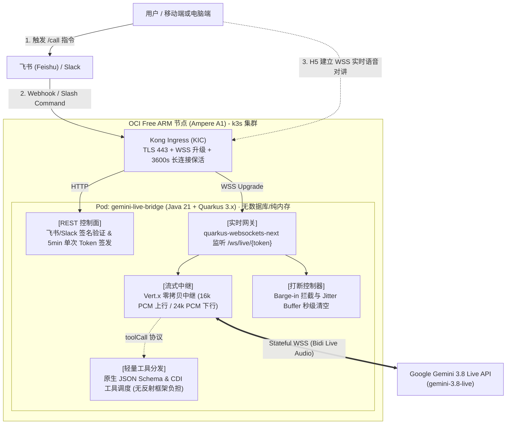

# Gemini Live Bridge (gemini-live-bridge)

[](LICENSE)
[](https://adoptium.net)
[](https://quarkus.io)
[](https://vertx.io)
[](https://k3s.io)
[](https://ai.google.dev)

> 🚀 **Realtime Voice Bridge Service** connecting IM platforms (**Feishu / Lark** & **Slack**) to Google **Gemini 3.8 Live API** for ultra-low latency, full-duplex bidirectional voice calls and natural agent conversations.
> 
> **Cloud Native Architecture**: Built on **Java 21 + Quarkus 3.x + Eclipse Vert.x**, engineered as a **pure stateless, zero-copy streaming audio gateway** without heavy DB or LLM framework overhead, ready for JVM & GraalVM Native deployment on **k3s OCI Free ARM (Ampere A1)**.

---

## 🌟 核心特性 (Key Features)

- 🎙️ **原生端到端全双工实时通话 (Native Full-Duplex Audio)**:
  - 基于 Google `gemini-3.8-live` 及 `gemini-3.8-live-extended-thinking` 原生音频大模型，告别传统 "ASR → LLM → TTS" 级联高延迟。
  - 上行 16kHz PCM (100ms 切片) 直推，下行接收 24kHz PCM 极清语音平滑播放。
- ⚡ **纯响应式无状态中继与零拷贝 (Stateless Reactive & Zero-Copy)**:
  - 服务定位为**高性能音视频流中继路由器**，零持久化数据库（纯内存并发管理 5min 单次 Token）；
  - 底层基于 **Eclipse Vert.x** 事件循环与零拷贝 Buffer 直推，JVM 内存仅 **~40MB**，Native 仅 **~15MB**，GC 毫秒级无感知。
- 🛠️ **轻量级原生 Function Calling 调度 (Native Tool Dispatcher)**:
  - 拒绝沉重的第三方 LLM 框架绑定（无动态反射与黑盒依赖），直接对接 Gemini Live 官方 Bidi Tool 协议，几行静态 CDI 代码即刻分发执行本地日程与运维工具。
- ⚡ **随时打断与自然插话 (Seamless Barge-in)**:
  - 结合 Web Audio API 与 Gemini Live 原生截断信号，用户开口说话瞬间自动停止远端音频播报，秒级 Flush Jitter Buffer。
- 📱 **飞书 / Slack 一键呼起 (IM Integration)**:
  - 用户在 IM 中通过 `/call` 触发，机器人秒级回推富文本交互卡片。点击即可直接在移动端飞书内置 Webview 或浏览器中全屏呼起。
- 🛡️ **k3s OCI-Free-ARM 原生适配 (Cloud Native)**:
  - 开箱提供针对 **Oracle Cloud Infrastructure (OCI) Free Tier ARM (Ampere A1, 4 OCPU, 24GB RAM)** 优化的 k3s 编排配置与 Kong Gateway WSS 路由配置。

---

## 🏗️ 系统部署架构图 (OCI ARM k3s)



---

## 📚 详细文档导航 (Documentation)

- 📐 [**系统架构与部署设计说明书 (Architecture & Deployment Spec)**](docs/architecture.md):
  - Java 21 + Quarkus 3.x 响应式分层架构；
  - 音频流 AudioWorklet 采样与 Jitter Buffer 管线；
  - k3s OCI-Free-ARM 节点编排与 Kong Ingress WSS 配置；
  - 生产级 Dockerfile (Mandrel Native AOT 多阶段构建)。
- 📋 [**需求规格说明书 (Product Requirements Document)**](docs/requirements.md): 业务场景、用户旅程、功能边界与 SLA 指标。
- 🔌 [**接口与协议规格说明书 (API & Protocol Specification)**](docs/api-specification.md):
  - 飞书 / Slack Webhook 与交互卡片接口；
  - 会话管理 RESTful 接口；
  - WebSocket 报文格式（PCM 音频二进制帧、JSON 打断与转写控制帧）。
- 🏛️ [**详细类设计说明书 (Class Design Document)**](docs/CLASS_DESIGN.md):
  - 响应式六层架构与 UML 类图规格；
  - 全双工音频零拷贝中继、Barge-in 打断时序与 Jitter Buffer 设计；
  - 强类型 `@ConfigMapping` 契约与 Java 21 Record 单元测试桩设计。
- 🚀 [**持续交付与部署策略规范 (Deployment Strategy Spec)**](docs/DEPLOYMENT_STRATEGY.md):
  - GitHub Actions Native CI 构建与 GHCR 发布；
  - ArgoCD 跨集群 (aliyun &rarr; tencent-dp1) 自动同步与防覆盖；
  - OCI Vault (`gateman-vault`) 凭据归档与生产 K3s Secret 注入 SOP。

---

## 📂 仓库目录规划 (Repository Structure)

```text
gemini-live-bridge/
├── docs/                             # 规格文档与架构设计
│   ├── architecture.md               # Quarkus 架构与 k3s OCI-ARM 部署设计
│   ├── requirements.md               # 需求说明书 (PRD)
│   ├── api-specification.md          # 详细接口与 WS 报文协议规格
│   ├── CLASS_DESIGN.md               # 详细类设计与 UML 说明书
│   └── DEPLOYMENT_STRATEGY.md        # 部署策略、GitOps 闭环与 OCI Vault 规范
├── k8s/                              # k3s / Kubernetes 生产部署清单
│   ├── 00-namespace.yaml             # 专属命名空间 (gemini-bridge)
│   ├── 01-configmap.yaml             # 基础运行时环境变量
│   ├── 02-secret.yaml                # 密钥与证书凭据模版
│   ├── 03-deployment.yaml            # ARM64 节点亲和性与探针编排
│   ├── 04-service.yaml               # 集群内 Service 定义
│   └── 05-ingress.yaml               # Kong Ingress WSS 长连接路由 (3600s 保活)
├── src/                              # Java 源码目录 (待实现)
│   └── main/
│       ├── java/asia/jppwl/bridge/
│       │   ├── config/               # @ConfigMapping 强类型配置
│       │   ├── domain/               # 会话管理与单次 Token (纯内存)
│       │   ├── api/                  # 飞书/Slack Webhook & Session 控制器
│       │   ├── websocket/            # quarkus-websockets-next 实时网关
│       │   ├── relay/                # Vert.x Gemini Live 双向音频流式中继
│       │   └── tool/                 # 原生轻量 Function Calling 工具分发
│       └── resources/
│           ├── application.properties
│           └── META-INF/resources/   # 轻量 H5 电话呼叫前端单页 (AudioWorklet)
├── pom.xml                           # Quarkus 3.x + Java 21 Maven 工程描述
├── .env-template                     # 本地环境变量配置模版
├── .gitignore
└── README.md
```

---

## 🚀 k3s 快速部署指引 (OCI ARM 节点)

### 1. 准备密钥配置
修改 `k8s/02-secret.yaml`，填入真实的 Google Gemini API Key 与各平台 Secret（遵循 POSIX UPPER_UNDERSCORE 命名）：
```yaml
stringData:
  BRIDGE_GEMINI_API_KEY: "AIzaSy..."
  BRIDGE_SESSION_SECRET_KEY: "your_random_jwt_secret"
  BRIDGE_FEISHU_APP_SECRET: "sec_..."
  BRIDGE_SLACK_SIGNING_SECRET: "slk_..."
```

### 2. 一键应用到 k3s
```bash
kubectl apply -f k8s/
```

### 3. 查看运行状态与日志
```bash
kubectl get pods -n gemini-bridge -o wide
kubectl logs -n gemini-bridge -l app=gemini-live-bridge -f
```

---

## 🤝 研发路线 (Roadmap)

- [x] **Phase 1: 极简架构与技术栈定稿 (当前阶段)** - 选型 Java 21 + Quarkus 3.x + Eclipse Vert.x，剔除多余重型 LLM 框架与数据库，完成全量接口协议、PRD 需求与 k3s OCI ARM 部署架构设计。
- [ ] **Phase 2: Quarkus WebSocket 网关与 Vert.x 桥接** - 实现客户端 WSS 接入与 Google Gemini 3.8 Live API 零拷贝音频双向流转发。
- [ ] **Phase 3: 原生 Function Calling 工具调度** - 注入 Hebe 人设并绑定日程/指令查询原生轻量 Tool。
- [ ] **Phase 4: H5 网页呼叫界面与飞书/Slack 卡片打通** - 完成 AudioWorklet 采样与端到端测试。
