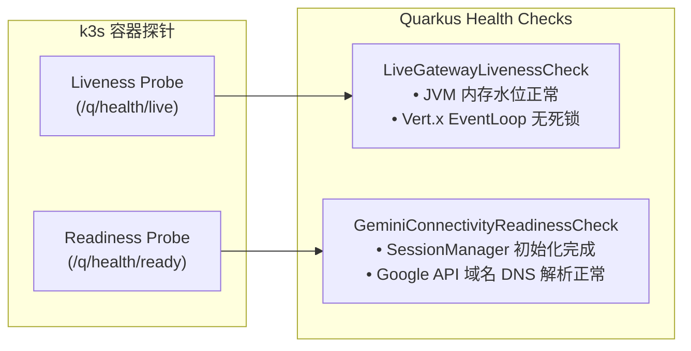
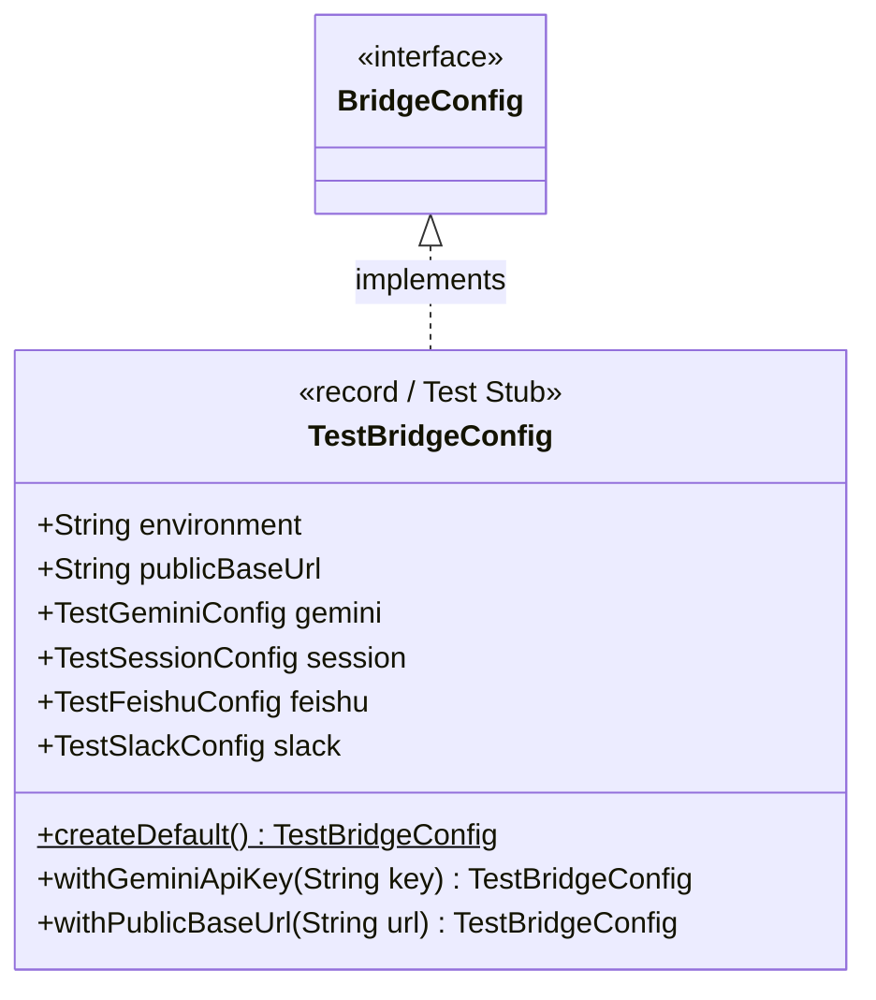

# 🏛️ Gemini Live Bridge 详细类设计说明书 (Class Design Document)

| 文档版本 | 编写日期 | 状态 | 核心架构规范 | 目标运行平台 |
| :--- | :--- | :--- | :--- | :--- |
| **v2.0.0** | 2026-09-21 | 详细设计定稿 (极简无状态) | Java 21 / Quarkus 3.x / Eclipse Vert.x (无数据库/无外部LLM框架) | k3s on OCI Free ARM64 (Ampere A1) |

---

## 1. 设计原则与工程边界

本服务定位为飞书 (Feishu) / Slack 企业协同平台与 Google Gemini 3.8 Live API 之间的**高性能无状态流式网络中继路由器 (Stateless Audio Streaming Router)**。类体系严格恪守以下核心准则：

1. **响应式与零拷贝内存管道 (Zero-Copy Reactive Pipeline)**：
   - 音频上行（16kHz PCM，每 100ms 一包，3200 字节）与下行（24kHz PCM）流吞吐极高。全面采用 Eclipse Vert.x `Buffer`，杜绝一切不必要的字节数组深度复制 (`byte[] clone`)；
   - WebSocket 通道基于 `quarkus-websockets-next`，网络 I/O 运行于 Vert.x Event Loop，业务 CPU 密集任务调度至虚拟线程 (Virtual Threads)。
2. **纯无状态与零持久化 (Stateless & No Database)**：
   - 彻底摒弃任何关系型/文档型数据库依赖；
   - 会话令牌管理基于内存 `ConcurrentHashMap`，配合 CAS 原子单次核销防重放，由 `@Scheduled` 看门狗定期淘汰过期会话；
   - 音频流管道化纯内存流转，绝不落盘持久化，兼顾超低延迟与隐私合规。
3. **确定性配置契约 (Deterministic Config Mapping)**：
   - 遵从 `cctv-collector` 规范，所有环境参数收敛至 `@ConfigMapping(prefix = "bridge")` 强类型接口，禁止在业务逻辑散落 `System.getenv()`；
   - 未标注 `@WithDefault` 的核心项（如 `BRIDGE_GEMINI_API_KEY`、`BRIDGE_SESSION_SECRET_KEY`）在 Quarkus 启动时触发严格的 **Fail-Fast 启动熔断**。
4. **会话生命周期与打断一致性 (Barge-in Consistency)**：
   - 客户端一次性握手令牌 (Ephemeral Token) 具备单次使用与防重放语义；
   - 用户打断 (`client.interrupt`) 到达瞬间，以纳秒级原子操作同步清理未发送的 Jitter Buffer，并向下游和上游广播状态回执。
5. **原生轻量 Function Calling 调度 (Native-Friendly Tool Dispatcher)**：
   - **坚决剔除任何第三方重型 LLM 框架（如 LangChain4j）**，规避动态类加载、反射黑盒与编译死锁；
   - 直接与 Gemini Live 原生 Bidi Tool 协议对接，通过标准 JSON Schema 与静态 CDI 调度本地工具，100% 具备 GraalVM Native AOT 编译友好度。

---

## 2. 核心 UML 类图 (Core UML Class Diagrams)

### 2.1 总体分层架构类图 (Architecture Overview)

```mermaid
classDiagram
    direction TB

    %% 1. 配置层
    namespace Config {
        class BridgeConfig {
            <<interface / ConfigMapping>>
            +environment() String
            +publicBaseUrl() String
            +gemini() GeminiConfig
            +session() SessionConfig
            +feishu() FeishuConfig
            +slack() SlackConfig
        }
        class GeminiConfig {
            <<interface>>
            +apiKey() String
            +modelName() String
            +voiceName() String
            +systemInstruction() String
        }
        class SessionConfig {
            <<interface>>
            +secretKey() String
            +tokenTtlSeconds() int
            +maxCallDurationSeconds() int
            +idleTimeoutSeconds() int
        }
        class FeishuConfig {
            <<interface>>
            +appId() Optional~String~
            +appSecret() Optional~String~
            +verificationToken() Optional~String~
            +encryptKey() Optional~String~
        }
        class SlackConfig {
            <<interface>>
            +botToken() Optional~String~
            +signingSecret() Optional~String~
        }
    }

    BridgeConfig *-- GeminiConfig
    BridgeConfig *-- SessionConfig
    BridgeConfig *-- FeishuConfig
    BridgeConfig *-- SlackConfig

    %% 2. 会话管理与安全领域
    namespace SessionDomain {
        class CallSession {
            <<record / Entity>>
            +String sessionId
            +String ephemeralToken
            +String userId
            +String platform
            +String channelId
            +String modelVariant
            +String voiceName
            +SessionStatus status
            +Instant createdAt
            +Instant expiresAt
            +Instant connectedAt
            +AtomicLong bytesUploaded
            +AtomicLong bytesDownloaded
            +isExpired() boolean
        }

        class SessionStatus {
            <<enumeration>>
            PENDING
            ACTIVE
            TERMINATED
            EXPIRED
        }

        class SessionManager {
            <<ApplicationScoped>>
            -ConcurrentMap~String, CallSession~ tokenIndex
            -ConcurrentMap~String, CallSession~ activeSessions
            -BridgeConfig config
            -Logger log
            +createSession(CreateSessionRequest req) CallSession
            +validateAndConsumeToken(String token) Optional~CallSession~
            +terminateSession(String sessionId, String reason) SessionSummary
            +sweepExpiredSessions() void
            +getActiveSessionCount() int
        }

        class TokenProvider {
            <<ApplicationScoped>>
            -BridgeConfig config
            +generateToken(String userId, String platform) String
            +verifyToken(String token) TokenClaims
        }
    }

    CallSession --> SessionStatus
    SessionManager --> CallSession
    SessionManager --> TokenProvider
    SessionManager ..> BridgeConfig

    %% 3. 控制面 Webhook & REST API
    namespace WebhookAPI {
        class FeishuWebhookResource {
            <<Path: /api/v1/feishu>>
            -SessionManager sessionManager
            -FeishuSignatureValidator validator
            -FeishuCardService cardService
            +handleEvent(FeishuEventPayload payload) Response
            +handleCardAction(FeishuCardActionPayload payload) Response
        }

        class SlackWebhookResource {
            <<Path: /api/v1/slack>>
            -SessionManager sessionManager
            -SlackSignatureValidator validator
            -SlackBlockKitService blockKitService
            +handleCommand(SlackCommandForm form) Response
            +handleInteraction(SlackInteractionPayload payload) Response
        }

        class CallSessionResource {
            <<Path: /api/v1/call/session>>
            -SessionManager sessionManager
            +create(CreateSessionRequest req) Response
            +validate(String token) Response
            +terminate(String token, TerminateRequest req) Response
        }
    }

    FeishuWebhookResource --> SessionManager
    SlackWebhookResource --> SessionManager
    CallSessionResource --> SessionManager

    %% 4. WebSocket 实时网关与流式中继
    namespace RealtimeGateway {
        class LiveWebSocketGateway {
            <<WebSocket: /ws/live/{token}>>
            -SessionManager sessionManager
            -GeminiLiveRelayService relayService
            -BargeInController bargeInController
            -Logger log
            +onOpen(WebSocketConnection conn, String token) Multi~Buffer~
            +onBinary(Buffer pcmChunk, WebSocketConnection conn) void
            +onTextMessage(String jsonText, WebSocketConnection conn) void
            +handleHeartbeat(WebSocketConnection conn, ClientPingEvent ping) void
            +onClose(WebSocketConnection conn) void
            +onError(Throwable err, WebSocketConnection conn) void
        }

        class ClientPingEvent {
            <<record / DTO>>
            +String event
            +long timestamp
        }

        class ServerPongEvent {
            <<record / DTO>>
            +String event
            +long timestamp
        }

        class BargeInController {
            <<ApplicationScoped>>
            -Logger log
            +handleClientInterrupt(String sessionId) BargeInReceipt
            +flushJitterBuffer(String sessionId) void
            +notifyModelInterruption(String sessionId) void
        }

        class JitterBufferManager {
            <<ApplicationScoped>>
            -ConcurrentMap~String, CircularAudioBuffer~ sessionBuffers
            +enqueue(String sessionId, Buffer pcmChunk) void
            +drain(String sessionId) List~Buffer~
            +clear(String sessionId) int
        }
    }

    LiveWebSocketGateway --> SessionManager
    LiveWebSocketGateway --> BargeInController
    LiveWebSocketGateway ..> ClientPingEvent
    LiveWebSocketGateway ..> ServerPongEvent
    BargeInController --> JitterBufferManager

    %% 5. Gemini 上游 WSS 直连与响应式流
    namespace GeminiUpstream {
        class GeminiLiveRelayService {
            <<ApplicationScoped>>
            -Vertx vertx
            -BridgeConfig config
            -ToolExecutionRouter toolRouter
            +openUpstreamChannel(CallSession session, DownstreamSink sink) GeminiLiveSession
        }

        class GeminiLiveSession {
            <<Stateful Bridge>>
            -WebSocket upstreamWs
            -CallSession session
            -DownstreamSink downstreamSink
            -AtomicBoolean isThinking
            +sendAudioChunk(Buffer pcm16k) void
            +sendTextMessage(String userText) void
            +sendToolResponse(String callId, JsonObject output) void
            +signalInterrupt() void
            +close() void
        }

        class GeminiMessageCodec {
            <<Utility>>
            +buildBidiSetupFrame(BridgeConfig config, CallSession session) JsonObject
            +buildRealtimeInputFrame(Buffer pcmChunk) JsonObject
            +parseServerContent(Buffer rawFrame) GeminiServerEvent
        }
    }

    LiveWebSocketGateway --> GeminiLiveRelayService
    GeminiLiveRelayService --> GeminiLiveSession
    GeminiLiveSession ..> GeminiMessageCodec

    %% 6. 原生轻量 Function Calling 工具调度 (无第三方反射框架)
    namespace NativeToolDispatcher {
        class ToolExecutionRouter {
            <<ApplicationScoped>>
            -SystemControlTools systemTools
            -CalendarTools calendarTools
            +buildFunctionDeclarations() JsonArray
            +executeToolCall(String functionName, JsonObject arguments) Uni~JsonObject~
        }

        class SystemControlTools {
            <<ApplicationScoped>>
            +queryClusterHealth() String
            +queryDeviceStatus(String deviceId) String
        }

        class CalendarTools {
            <<ApplicationScoped>>
            +getTodaySchedule(String userId) String
            +createReminder(String content, String time) boolean
        }
    }

    GeminiLiveRelayService --> ToolExecutionRouter
    ToolExecutionRouter --> SystemControlTools
    ToolExecutionRouter --> CalendarTools
```

---

### 2.2 实时双向流与 Barge-in 打断时序图 (Full-Duplex Audio & Barge-in Sequence)

```mermaid
sequenceDiagram
    autonumber
    actor User as 用户 (移动端 H5 浏览器)
    participant GW as LiveWebSocketGateway (/ws/live/{token})
    participant SM as SessionManager
    participant BIC as BargeInController & JitterBuffer
    participant Relay as GeminiLiveSession (Upstream Relay)
    participant ToolRouter as ToolExecutionRouter
    participant Gemini as Google Gemini 3.8 Live API

    User->>GW: WSS 握手 (/ws/live/{token})
    GW->>SM: validateAndConsumeToken(token)
    SM-->>GW: Token 有效，核销并激活 CallSession
    GW->>Relay: openUpstreamChannel(session)
    Relay->>Gemini: WSS 连接 + 发送 Setup 帧 (BidiConfig: Puck + SystemPrompt + Tools)
    Gemini-->>Relay: SetupComplete 确认
    GW-->>User: session.ready { audio_format: 16k in / 24k out }

    rect rgb(240, 248, 255)
    Note over User,Gemini: 正常全双工语音对讲阶段
    User->>GW: 二进制帧 (16kHz PCM, 100ms, 3200 字节)
    GW->>Relay: sendAudioChunk(Buffer) (零拷贝流推)
    Relay->>Gemini: realtimeInput { mediaChunks: [mime: "audio/pcm;rate=16000", data: base64] }
    Gemini-->>Relay: serverContent { modelTurn: { parts: [ { inlineData: pcm24k } ] } }
    Relay->>GW: 转发下行 24kHz PCM Buffer
    GW-->>User: 二进制帧 (24kHz PCM 音频切片，AudioWorklet 平滑播放)
    Gemini-->>Relay: serverContent { transcript: "主人下午好，日程如下..." }
    Relay->>GW: transcript.delta 事件
    GW-->>User: JSON 文本帧: {"event":"transcript.delta","delta":"主人下午好..."}
    end

    rect rgb(255, 250, 240)
    Note over User,GW: Cloudflare 15s 空闲防断心跳环 (Keep-Alive Ping/Pong)
    User->>GW: 文本帧: {"event":"client.ping","timestamp":1726848015000}
    GW-->>User: 文本帧: {"event":"server.pong","timestamp":1726848015005}
    Note over User,GW: 持续重置 Cloudflare Edge 100s 倒计时与 Kong upstream 计时器
    end

    rect rgb(255, 240, 245)
    Note over User,Gemini: 突发用户打断拦截 (Barge-in Interrupt)
    User->>User: AudioWorklet VAD 检测到用户重新开声
    User-->>User: 瞬间静音本地扬声器，清空播放队列
    User->>GW: 文本帧: {"event":"client.interrupt","timestamp":1726848035120}
    GW->>BIC: handleClientInterrupt(sessionId)
    BIC->>BIC: flushJitterBuffer() 清空内部排队音频
    BIC->>Relay: signalInterrupt()
    Relay->>Gemini: clientContent { turnComplete: true, interrupt: true }
    Gemini-->>Relay: 截断当前回复并停发后续下行音频
    BIC-->>GW: 打断拦截完成
    GW-->>User: 文本帧: {"event":"server.interrupted"}
    end

    rect rgb(245, 255, 240)
    Note over Relay,ToolRouter: 模型触发 Function Calling 工具调用
    Gemini-->>Relay: toolCall { name: "getTodaySchedule", args: {"userId":"Jason"} }
    Relay->>ToolRouter: executeToolCall("getTodaySchedule", args)
    ToolRouter->>ToolRouter: CDI 动态分发至 CalendarTools.getTodaySchedule()
    ToolRouter-->>Relay: 返回结果 JsonObject: {"schedules":["15:00 团队评审"]}
    Relay->>Gemini: toolResponse { response: {"output": "15:00 团队评审"} }
    Gemini-->>Relay: 结合工具输出，继续流式吐出语音回复
    Relay->>GW-->>User: 下行语音与字幕流
    end
```

---

## 3. 分包架构与设计说明

工程根包名定位为 `asia.jppwl.bridge`，分为六大高内聚低耦合模块：

```text
asia.jppwl.bridge/
├── config/                  # 强类型配置契约 (@ConfigMapping)
│   ├── BridgeConfig.java
│   └── DotEnv.java
├── domain/                  # 会话核心领域模型与防重放
│   ├── CallSession.java
│   ├── SessionStatus.java
│   ├── TokenClaims.java
│   ├── SessionManager.java
│   └── TokenProvider.java
├── api/                     # 控制面 RESTful 接口与 IM 回调
│   ├── feishu/
│   │   ├── FeishuWebhookResource.java
│   │   ├── FeishuSignatureValidator.java
│   │   └── FeishuCardService.java
│   ├── slack/
│   │   ├── SlackWebhookResource.java
│   │   ├── SlackSignatureValidator.java
│   │   └── SlackBlockKitService.java
│   └── session/
│       ├── CallSessionResource.java
│       ├── dto/CreateSessionRequest.java
│       └── dto/SessionResponse.java
├── websocket/               # 客户端实时网关 (quarkus-websockets-next)
│   ├── LiveWebSocketGateway.java
│   ├── BargeInController.java
│   ├── JitterBufferManager.java
│   ├── dto/ClientControlEvent.java
│   └── dto/ServerControlEvent.java
├── relay/                   # 上游 Gemini Live API 直连与零拷贝中继
│   ├── GeminiLiveRelayService.java
│   ├── GeminiLiveSession.java
│   ├── GeminiMessageCodec.java
│   └── DownstreamSink.java
└── tool/                    # 原生轻量 Function Calling 工具分发 (无外部反射框架)
    ├── ToolExecutionRouter.java
    └── handler/
        ├── CalendarTools.java
        └── SystemControlTools.java
```

---

## 4. 核心类职责与接口规格声明

### 4.1 `asia.jppwl.bridge.config.BridgeConfig` (配置总纲)

- **职责**：作为统一配置单一真实源，由 Quarkus 自动绑定操作系统环境变量 `BRIDGE_*`。
- **关键方法**：
  ```java
  @ConfigMapping(prefix = "bridge")
  public interface BridgeConfig {
      @WithDefault("production") String environment();
      String publicBaseUrl(); // 必填，Fail-Fast
      GeminiConfig gemini();
      SessionConfig session();
      FeishuConfig feishu();
      SlackConfig slack();

      interface GeminiConfig {
          String apiKey(); // 必填，机密
          @WithDefault("gemini-3.8-live") String modelName();
          @WithDefault("Puck") String voiceName();
          @WithDefault("你叫Hebe，是主人的专属贴心女仆与专业个人秘书。语言风格自然、温暖、干练，回答言简意赅。")
          String systemInstruction();
      }

      interface SessionConfig {
          String secretKey(); // 必填，机密
          @WithDefault("300") int tokenTtlSeconds();
          @WithDefault("1800") int maxCallDurationSeconds();
          @WithDefault("120") int idleTimeoutSeconds();
      }

      interface FeishuConfig {
          Optional<String> appId();
          Optional<String> appSecret();
          Optional<String> verificationToken();
          Optional<String> encryptKey();
      }

      interface SlackConfig {
          Optional<String> botToken();
          Optional<String> signingSecret();
      }
  }
  ```

---

### 4.2 会话管理与防重放核心领域设计 (`asia.jppwl.bridge.domain`)

本模块是整个流媒体桥梁服务的“生命周期心脏”，在无数据库依赖的纯内存架构下，负责会话安全鉴权、单次 Token 核销以及多维度看门狗管理。

#### 核心类清单与角色分工表

| 类名 | 类型 | 角色分类 | 职责说明 |
| :--- | :---: | :---: | :--- |
| **`SessionStatus`** | `enum` | **枚举模型** | 会话状态机：`PENDING`（刚生成链接待进入）、`ACTIVE`（正在通话）、`TERMINATED`（已挂断）、`EXPIRED`（超时未接入）。 |
| **`CallSession`** | `record` | **核心领域实体 (Domain Model)** | 承载单次通话的元数据：会话 ID、一次性 Token、用户 ID、平台（飞书/Slack）、创建时间、过期时间、上下行吞吐字节计数器（`AtomicLong`）等。 |
| **`CreateSessionRequest`** | `record` | **请求 DTO** | 飞书/Slack 发起 `/call` 时的入参封装（用户、频道、模型、发音人等）。 |
| **`SessionSummary`** | `record` | **响应/结果 DTO** | 通话结束时的结算单：实际通话时长、消耗流量字节、挂断原因（用户挂断 / 超时 / 异常）。 |
| **`SessionManager`** | **Class (CDI Bean)** | ⚡ **核心领域服务 (Domain Service)** | **【核心逻辑服务】** 负责具体的业务控制：<br>1. **Token 签发**：生成带加密签名的临时安全凭据；<br>2. **原子防重放 (CAS)**：WSS 握手时原子核销 Token，确保一个链接绝对不能被连两次；<br>3. **定时看门狗 (`@Scheduled`)**：每 30 秒自动扫盘，清理超过 5 分钟没来连线的死 Token，以及超过 30 分钟硬上限的超时通话。 |

#### `SessionManager` 关键方法契约
- **线程安全性**：内部由两组高并发 `ConcurrentHashMap` 驱动：`tokenIndex`（以一次性令牌为键）与 `activeSessions`（以会话唯一 UUID 为键）。
- **核心契约签名**：
  ```java
  @ApplicationScoped
  public class SessionManager {
      // 签发会话并生成有效期 5min 的临时单次 Token
      public CallSession createSession(CreateSessionRequest req);

      // 客户端建立 WebSocket 握手时原子核销 Token（CAS 操作）
      // 若 Token 已被核销或已过期，立即返回 Optional.empty() 并拒绝连接
      public Optional<CallSession> validateAndConsumeToken(String token);

      // 挂断并清理会话，返回通话时长与吞吐量摘要
      public SessionSummary terminateSession(String sessionId, String reason);

      // 定时看门狗：清理超期未连线或超过 30 分钟硬上限的僵尸会话
      @Scheduled(every = "30s")
      public void sweepExpiredSessions();
  }
  ```

---

### 4.3 `asia.jppwl.bridge.websocket.LiveWebSocketGateway` (响应式长连接网关)

- **职责**：基于 `quarkus-websockets-next` 提供原生 `@WebSocket` 终端，处理音视频流分发、应用层长连接保活与边界异常阻断。
- **性能规范**：
  - 对 16kHz PCM 二进制帧走 Vert.x 零拷贝通道直接中继；
  - 对打断事件 (`client.interrupt`) 委托 `BargeInController` 毫秒级拦截；
  - **防 Cloudflare 100s 熔断心跳**：当解析到 `client.ping` 文本帧时，直接同步回推 `server.pong`，持续刷新 Edge CDN 与 Kong 的空闲保活计时器。
- **Kong 网关边界防御与 Close Code 规范**：
  - 若握手时 Token 无效或已被核销（重放攻击），服务端立即发送 WebSocket Close Frame **`4001 (Unauthorized / Token Consumed)`** 并切断底层 TCP，防止恶意连接占用 Kong Upstream 连接配额；
  - 若超过 120 秒无任何音频与心跳活动，主动发送 Close Frame **`4008 (Idle Timeout)`** 优雅释放上游 Gemini 会话。
- **关键注解与方法**：
  ```java
  @WebSocket(path = "/ws/live/{token}")
  @ApplicationScoped
  public class LiveWebSocketGateway {
      @OnOpen
      public void onOpen(WebSocketConnection conn, @PathParam("token") String token);

      @OnBinary
      public void onBinary(Buffer pcmChunk, WebSocketConnection conn);

      @OnTextMessage
      public void onTextMessage(String jsonPayload, WebSocketConnection conn);

      // 处理心跳保活帧 (15s 一次)
      public void handleHeartbeat(WebSocketConnection conn, ClientPingEvent ping);

      @OnClose
      public void onClose(WebSocketConnection conn);

      @OnError
      public void onError(WebSocketConnection conn, Throwable error);
  }
  ```

---

### 4.4 `asia.jppwl.bridge.websocket.BargeInController` (双向打断与抖动控制器)

- **职责**：实现毫秒级打断拦截，彻底消灭 AI 播报自言自语、无法插话的体验痛点。
- **核心操作原子性**：
  1. 向 `JitterBufferManager` 发出 `clear(sessionId)` 命令，瞬间丢弃网关层尚未下发给客户端的所有 24kHz 音频缓冲；
  2. 向上游 `GeminiLiveSession` 发送 Client Content 截断帧，使 Gemini 服务端立即停止生成下一 Token；
  3. 向客户端回推 `server.interrupted` JSON 报文，驱动前端 Web Audio 播放队列瞬间重置。

---

### 4.5 `asia.jppwl.bridge.relay.GeminiLiveRelayService` & `GeminiLiveSession` (上游长连接通道)

- **职责**：管理与 Google 官方 `wss://generativelanguage.googleapis.com` 的 WebSocket 双向长连接，处理 Setup 帧握手、Function Calling 动态调度与音视频编解码。
- **零拷贝中继流水线**：
  ```java
  public class GeminiLiveSession {
      // 直连上游音频管道
      public void sendAudioChunk(Buffer pcm16k);

      // 文本透传
      public void sendTextMessage(String userText);

      // 回填 Tool 执行结果
      public void sendToolResponse(String callId, JsonObject output);

      // 截断信令
      public void signalInterrupt();

      // 优雅关闭上游 Session
      public void close();
  }
  ```

---

### 4.6 `asia.jppwl.bridge.tool.ToolExecutionRouter` (原生轻量工具调度器)

- **职责**：当 Gemini Live 在 WebSocket 连接中下发 `toolCall` 决策帧时，在当前工作线程直接以静态方法分发至对应的 CDI Bean，并将执行结果封包为 `toolResponse` 回填模型。
- **与重型框架对比优势**：
  - **零黑盒反射**：无需 LangChain4j 的动态代理与字节码生成；
  - **100% Native AOT 兼容**：工具列表通过原生 Vert.x `JsonArray` 在 Setup 握手阶段静态下发，完全免疫 GraalVM Native 反射缺失问题。
- **核心方法契约**：
  ```java
  @ApplicationScoped
  public class ToolExecutionRouter {
      // 构造注入 Google Live 握手需要的工具声明列表 (JSON Schema)
      public JsonArray buildFunctionDeclarations();

      // 根据工具方法名静态分发执行
      public Uni<JsonObject> executeToolCall(String functionName, JsonObject arguments);
  }
  ```

---

## 5. 云原生健康与生命周期检查契约 (MicroProfile Health)

类体系与 K3s 探针全面联动：



- **Liveness**：监测服务内存水位与事件循环健康度；
- **Readiness**：监测系统会话管理器、配置映射注入完整性以及与外部网络的基础连通性。任何致命配置缺失（如 `BRIDGE_GEMINI_API_KEY` 缺失）将导致 Readiness 探针返回 `DOWN`，阻止流量接入。

---

## 6. 单元测试架构设计 (Test Stubs & Record Mocks)

遵循 `cctv-collector` 的轻量测试理念，杜绝测试执行时的重度依赖：



- **`TestBridgeConfig` (Java 21 Record)**：实现 `BridgeConfig` 接口，提供全套内存默认测试桩，使得 `SessionManagerTest`、`BargeInControllerTest` 等核心单元测试无需启动 Quarkus 容器、无需读取外部 `.env`，实现 **毫秒级纯内存快速验证**。
