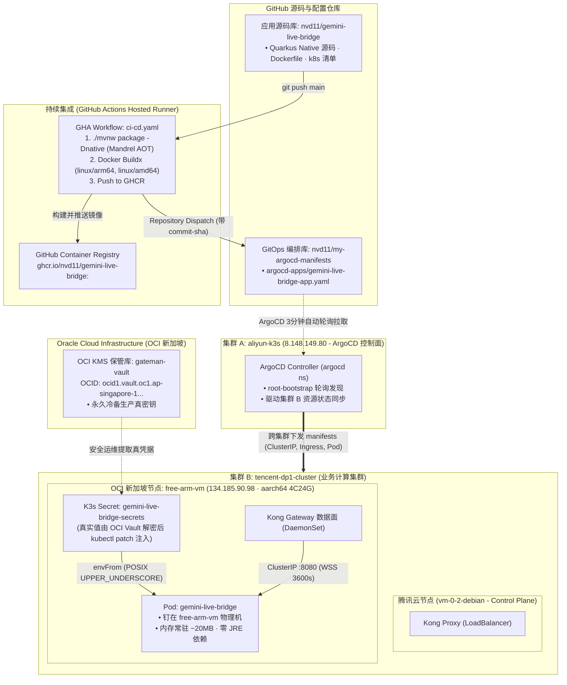

# 🚀 Gemini Live Bridge - 持续交付与部署策略规范 (Deployment Strategy Spec)

| 文档版本 | 制定日期 | 状态 | 交付范式 | 生产目标基础设施 |
| :--- | :--- | :--- | :--- | :--- |
| **v1.0.0** | 2026-09-21 | 正式定稿 | GitHub Actions CI + ArgoCD GitOps (App-of-Apps) | k3s on OCI Free ARM64 (`tencent-dp1-cluster` / `free-arm-vm`) |

---

## 1. 总体部署拓扑与物理归属

整个部署体系严格依托主人的跨云集群拓扑进行物理与逻辑分离：



---

## 2. 部署目标拓扑与计算调度规约

1. **目标集群**：
   - **名称**：`tencent-dp1-cluster`（集群 B）；
   - **控制面接入**：注册在阿里云集群 A 的 ArgoCD 中，作为 `external cluster` 统一被声明式纳管。
2. **物理宿主节点调度 (Node Affinity & Selector)**：
   - 服务必须强制调度到 **OCI 新加坡 ARM 巨兽节点 (`free-arm-vm`)**：
     ```yaml
     nodeSelector:
       kubernetes.io/arch: arm64
       kubernetes.io/hostname: free-arm-vm
     ```
   - **硬核原因**：
     - **极速国际连线**：`free-arm-vm` 位于 OCI 新加坡机房，距离 Google Gemini Live 海外 API 物理网络最近，直连 RTT 最优（避免走国内节点产生二次出海 WAN 延迟）；
     - **超充沛资源**：4 OCPU (Ampere A1) + 24GB 内存，且与同宿主机的 Redis、Kong 形成同一本地环网（Localhost/VPC 内网），性能损耗为 0。

---

## 3. 全自动 GitOps 持续交付流水线 (CI/CD)

整个系统严格遵守 **“提交即构建，合入即上线”** 的 GitOps 闭环：

### 3.1 第一阶段：GitHub Actions 持续集成 (CI)
触发文件：`.github/workflows/ci-cd.yaml`
1. **代码过滤**：自动忽略 `docs/**`、`*.md` 和 `.gitignore`，避免非代码改动浪费 Actions 构建额度；
2. **跨平台原生构建**：
   - 启用 QEMU 模拟与 Docker Buildx；
   - 基于根目录 `Dockerfile`，使用 Mandrel JDK 21 执行 `-Dnative` 静态编译，生成 `linux/arm64` 纯二进制镜像；
3. **推送到 GHCR**：
   - 镜像标签双重打标：`ghcr.io/nvd11/gemini-live-bridge:<commit-sha>` 以及 `latest`；
4. **跨仓库唤醒 (Repository Dispatch)**：
   - CI 构建完成后，使用 GitHub PAT 触发 `nvd11/my-argocd-manifests` 仓库的 `update-image-tag` 事件，自动将对应 App 清单的镜像 tag 刷成最新的 `<commit-sha>`。

### 3.2 第二阶段：ArgoCD 持续部署 (CD)
1. **双层发现与同步**：
   - 阿里云控制面上的 `root-bootstrap` 自动检测到清单库变更；
   - 子应用 `gemini-live-bridge` 在目标集群 `tencent-dp1-cluster` 上触发滚动更新（RollingUpdate）；
2. **防覆盖铁律 (`ignoreDifferences`)**：
   - ArgoCD 清单已配置忽略 Secret `/data` 路径比对，确保自动部署永远**不会抹杀集群内已注入的真实生产凭证**。

---

## 4. 机密凭据治理：OCI Vault 备份与 K3s 集群注入

按照主人的安全资产架构规范，生产环境凭据实行 **“云端冷备保密库 (OCI Vault) + 集群热运行 (K3s etcd Secret)”** 的两级治理体系，**代码库（Git）绝对零明文**。

### 4.1 核心机密凭据清单与 OCI Vault 空间

所有真实凭证统一托管在主人的 **OCI 新加坡专属 KMS 保管库** 中：
- **保管库名称**：`gateman-vault`
- **Vault OCID**：`ocid1.vault.oc1.ap-singapore-1.gzvit7i7aafnq.abzwsljrfizxwtz2vyxzxmdmf7btjtyt7dyxdnhionj5insb2pvxvudf5fhq`
- **主密钥 (Master Encryption Key)**：`gateman-vault-key`

| 凭据参数名 (POSIX) | 敏感级别 | 用途说明 | OCI Vault Secret 命名规范 |
| :--- | :---: | :--- | :--- |
| **`BRIDGE_GEMINI_API_KEY`** | 🔴 极高危 | Google Gemini 3.8 Live API 调用核心凭据 | `gemini-live-bridge-api-key` |
| **`BRIDGE_SESSION_SECRET_KEY`** | 🔴 极高危 | 客户端 5min 单次 JWT 令牌签名私钥 (32-byte Hex) | `gemini-live-bridge-session-secret` |
| **`BRIDGE_FEISHU_APP_SECRET`** | 🟠 高危 | 飞书开放平台应用身份凭据 (回调校验与下发卡片) | `gemini-live-bridge-feishu-secret` |
| **`BRIDGE_FEISHU_VERIFICATION_TOKEN`**| 🟡 中危 | 飞书事件订阅验证 Token | `gemini-live-bridge-feishu-token` |
| **`BRIDGE_SLACK_SIGNING_SECRET`** | 🟠 高危 | Slack Slash Command `/call` 签名校验 Secret | `gemini-live-bridge-slack-secret` |
| **`BRIDGE_SLACK_BOT_TOKEN`** | 🟠 高危 | Slack Bot API 调用 OAuth Token (`xoxb-...`) | `gemini-live-bridge-slack-bot-token` |

---

### 4.2 运维实战操作 SOP：从 OCI Vault 到 K3s 集群

#### 步骤 1：在 OCI Vault 创建/备份机密（通过 OCI CLI）
在具备 OCI 权限的主机（如 `Moon` 或本地环境）执行：
```bash
# 读取本地生成的 32 字节随机 Session 密钥
SESSION_KEY=$(openssl rand -hex 32)

# 将密钥密文写入 OCI Vault
oci vault secret create-base64 --compartment-id <COMPARTMENT_OCID> \
  --secret-name "gemini-live-bridge-session-secret" \
  --vault-id "ocid1.vault.oc1.ap-singapore-1.gzvit7i7aafnq.abzwsljrfizxwtz2vyxzxmdmf7btjtyt7dyxdnhionj5insb2pvxvudf5fhq" \
  --key-id <KEY_OCID> \
  --secret-content-content $(echo -n "$SESSION_KEY" | base64)
```

#### 步骤 2：从 OCI Vault 提取并注入到集群 B (tencent-dp1-cluster)
通过跳板机直连到腾讯云控制面节点（`43.139.214.231`）：
```bash
# 1. 登录集群控制面
ssh gateman@43.139.214.231

# 2. 从 OCI Vault 读取解码后的明文（或由管理员安全贴入），执行原子 Patch
sudo -n k3s kubectl -n gemini-bridge patch secret gemini-live-bridge-secrets --type merge \
  -p '{
    "stringData": {
      "BRIDGE_GEMINI_API_KEY": "AIzaSy_真实Google密钥",
      "BRIDGE_SESSION_SECRET_KEY": "'"$SESSION_KEY"'",
      "BRIDGE_FEISHU_APP_SECRET": "真实飞书Secret",
      "BRIDGE_FEISHU_VERIFICATION_TOKEN": "真实飞书Token",
      "BRIDGE_SLACK_SIGNING_SECRET": "真实SlackSecret"
    }
  }'

# 3. 重启 Pod 使新配置生效（纯无状态，2 秒内滚动平滑重拉）
sudo -n k3s kubectl -n gemini-bridge rollout restart deploy/gemini-live-bridge
```

---

## 5. 入口网关与域名网络路径 (Kong + Cloudflare)

1. **生产接入 FQDN**：`voice.jppwl.asia`
2. **流量链路时延与节点拓扑**：
   ```text
   用户终端 (移动端飞书/Slack/浏览器)
        │
        ▼ (HTTPS / WSS · 免费 Universal SSL 终结)
   Cloudflare Edge CDN (代理加速 · 开启 15s 双向 Ping/Pong 抵消 100s 空闲熔断)
        │
        ▼ (443 / WSS)
   OCI 新加坡节点 free-arm-vm (134.185.90.98 / Tailscale 100.105.130.0)
        │
        ▼ (NodePort 31324 / Kong LoadBalancer)
   Kong Gateway 数据面 (3600s Upstream Read/Write Timeout)
        │
        ▼ (ClusterIP: gemini-live-bridge-svc:8080)
   Pod: gemini-live-bridge (Quarkus Native AOT Runner)
        │
        ▼ (海外公网直通 Google 骨干网 · WSS)
   Google Gemini 3.8 Live API (极低海外 RTT)
   ```
3. **灰云应急逃生**：
   - 一旦 Cloudflare 节点网络发生海外震荡，在 Cloudflare 控制台将 `voice.jppwl.asia` 的 Proxy 状态由“小黄云”切换为“纯灰云 (DNS Only)”，解析直接指向 `134.185.90.98`，端到端音频跳数立减 1 跳，彻底由源站 Kong 网关接管全部 3600 秒长连接保活。

---

## 6. 异常回滚与灾难恢复机制 (Disaster Recovery)

1. **代码或镜像故障**：
   - 在 `nvd11/my-argocd-manifests` 仓库直接执行 `git revert HEAD`；
   - ArgoCD 自动检测并在 30 秒内全自动回滚到上一个稳定的 ARM64 镜像版本；
2. **节点故障自动漂移**：
   - 若 OCI ARM 宿主机维护，只需临时在 Deployment 清单中放开 `nodeSelector: free-arm-vm` 限制；
   - 副本自动漂移至 `tencent-dp1-cluster` 的腾讯云主控机或 NUC 节点，Kong 网关自动感知 Service Endpoint 更新，秒级自愈。
