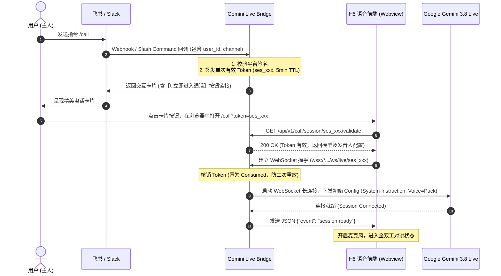
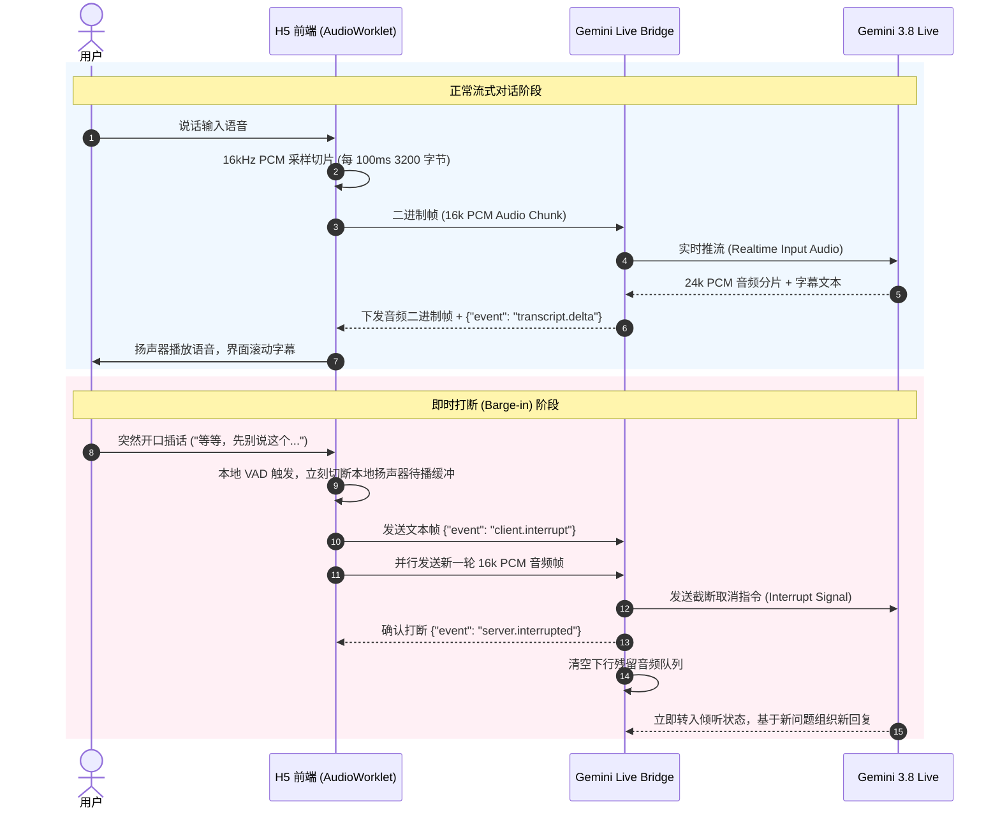

# Gemini Live Bridge - 系统架构与详细时序设计

| 文档版本 | 创建日期 | 状态 | 编写人 |
| :--- | :--- | :--- | :--- |
| v1.0.0 | 2026-09-20 | 定稿 | Hebe |

---

## 1. 系统总体架构图

```text
+-----------------------------------------------------------------------------------+
|                                 客户端接入层 (Client)                              |
|                                                                                   |
|  [ 飞书 (Feishu) App ]       [ Slack Client ]          [ 手机/PC 浏览器 Webview ]  |
|          |                         |                                |             |
|    /call 指令                /call 指令                      H5 语音对讲界面         |
|    点击消息卡片              点击交互按钮                    AudioWorklet 实时采样  |
+----------|-------------------------|--------------------------------|-------------+
           |                         |                                |
           | HTTPS Webhook           | HTTPS Slash Command            | WSS 16k PCM
           v                         v                                v
+-----------------------------------------------------------------------------------+
|                        Gemini Live Bridge 网关层 (FastAPI)                         |
|                                                                                   |
|   +--------------------------+  +-------------------------+  +------------------+  |
|   |   Feishu/Slack 适配器    |  |   会话鉴权与 Token 管理  |  |  WSS 客户端网关   |  |
|   |  - 签名验证 (HMAC-SHA256)|  |  - 签发 5min 临时 Token |  | - 二进制音频流解析|  |
|   |  - 卡片消息生成与回传    |  |  - 状态追踪 (Ready/Dead)|  | - JSON 控制事件  |  |
|   +--------------------------+  +-------------------------+  +--------+---------+  |
|                                                                       |            |
|   +-------------------------------------------------------------------+---------+  |
|   |                     双向长连接中继引擎 (Bidi Relay Engine)                   |  |
|   |  - 下行 24k PCM 缓冲分发                                                    |  |
|   |  - 上行 16k PCM 封装打包                                                    |  |
|   |  - Barge-in (即时打断) 信号双向拦截与队列清理                                |  |
|   |  - 心跳保活与空闲静音监控 (Idle Watchdog)                                   |  |
|   +-------------------------------------------------------------------+---------+  |
+-----------------------------------------------------------------------|-----------+
                                                                        |
                                            WSS (Live API Protocol / google-genai)
                                                                        v
+-----------------------------------------------------------------------------------+
|                            Google 官方大模型基础设施                                |
|                                                                                   |
|             [ Gemini 3.8 Live API (`gemini-3.8-live`) ]                            |
|             [ Extended Thinking 推理引擎 (`gemini-3.8-live-extended-thinking`) ]  |
+-----------------------------------------------------------------------------------+
```

---

## 2. 核心业务交互时序 (Sequence Diagrams)

### 2.1 呼叫建立与卡片唤起流程 (Call Initialization)



---

### 2.2 全双工实时音频交互与打断流程 (Bidi Audio & Barge-in)



---

## 3. 音频流处理管线 (Audio Processing Pipeline)

### 3.1 上行管线 (麦克风 -> 模型)
1. **浏览器捕获**：
   - 依赖 WebRTC 标准接口 `navigator.mediaDevices.getUserMedia({ audio: true })`。
   - 关键音频配置：
     - `echoCancellation: true` (声学校验回声消除，防止喇叭放音被录入)；
     - `noiseSuppression: true` (背景白噪音降噪)；
     - `autoGainControl: true` (动态人声音量增益)。
2. **AudioWorklet 线程处理**：
   - 不占用主 UI 渲染线程，在后台高优先级线程运行；
   - 采集设备原始采样率（通常为 44.1kHz 或 48kHz）；
   - 执行高质量线性插值重采样为 **16,000 Hz**；
   - 将 Float32 样本转换为 **Int16 Signed Little-Endian** 二进制格式；
   - 累积到 1600 个样本（100ms）时通过 `postMessage` 传回主线程推给 WebSocket。

### 3.2 下行管线 (模型 -> 扬声器)
1. **Google 官方规格**：下行原始音频流为 **24,000 Hz, 16-bit Mono Little-Endian PCM**。
2. **Jitter Buffer 抖动缓冲**：
   - 前端接收到二进制 ArrayBuffer；
   - 转换回 Float32 样本写入环形队列（Circular Buffer）；
   - 使用 Web Audio API 的 `AudioContext` 以精确采样时间戳调度 `AudioBufferSourceNode` 进行无缝拼接播放，杜绝音频突变爆音。

---

## 4. 安全防护与高可用设计

1. **防盗刷与连接收敛**：
   - **Ephemeral Token 机制**：每个 Token 仅能握手一次，5 分钟不使用即失效；
   - **最大连接数限流**：针对单个用户 ID 限制同时只能维持 1 个活动通话，防止恶意并发堆积；
   - **绝对最大通话时长**：单次通话强制硬上限 30 分钟，到期自动发送 `session.closed` 并释放 Google 连接。
2. **密钥绝对隔离**：
   - 客户端仅获得与中继微服务通信的 `token`，永无可能接触到 Google API Key 与企业 IM Secret。
3. **网络与部署隔离**：
   - 服务可容器化部署在内网/边缘节点（如 Radxa 或云服务器），通过统一反向代理（Caddy / Nginx）配置强加密 TLS 证书对外暴露。
