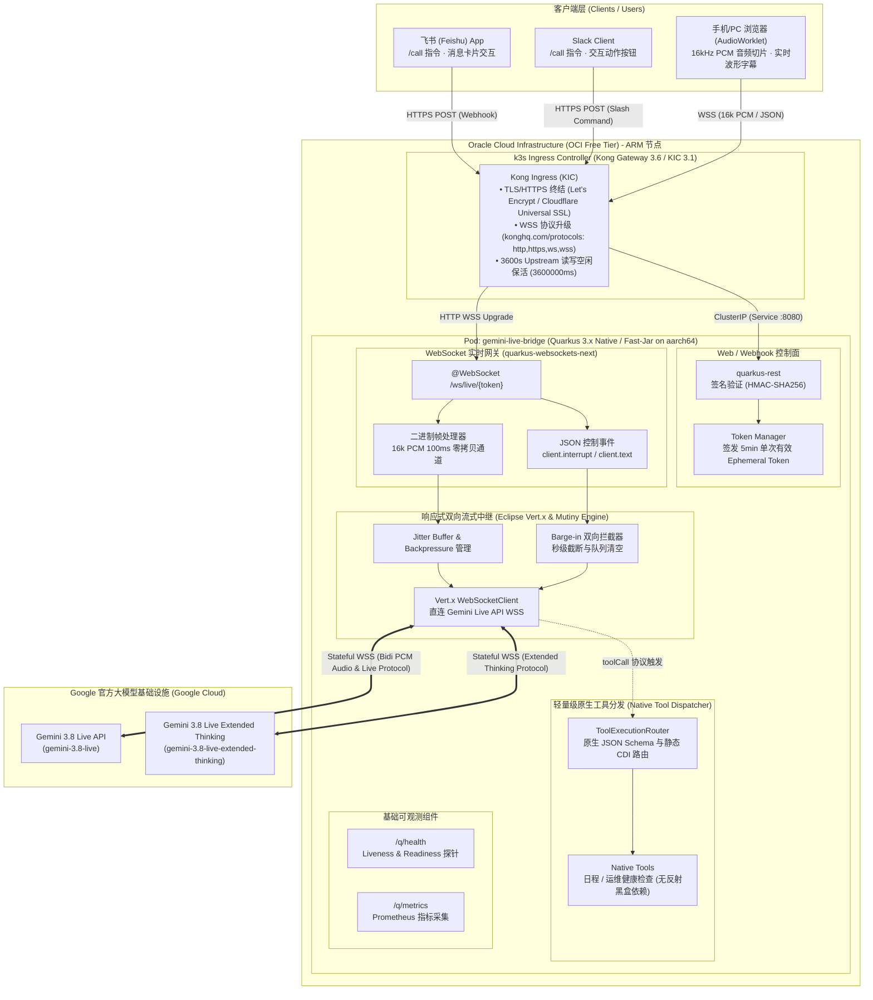
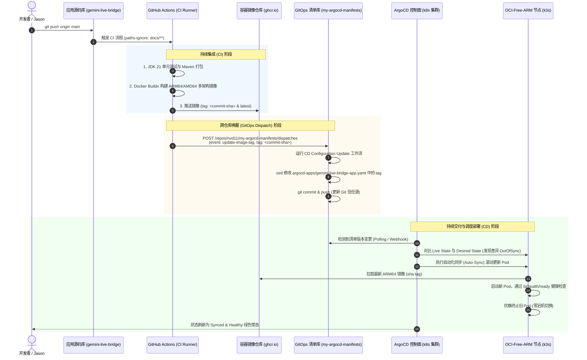
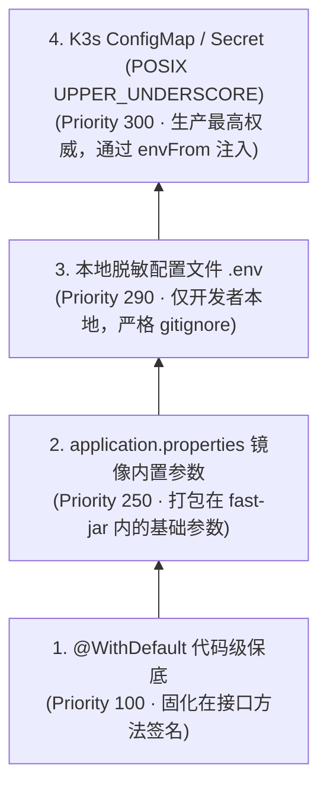
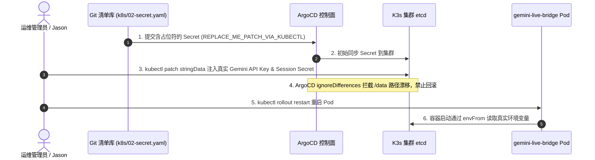

# Gemini Live Bridge - 系统架构与部署设计说明书 (Quarkus on k3s OCI-ARM)

| 文档版本 | 创建日期 | 状态 | 编写人 | 核心技术栈 | 部署目标 | 交付模式 |
| :--- | :--- | :--- | :--- | :--- | :--- | :--- |
| v3.0.0 | 2026-09-21 | 架构定稿 (极简无状态) | Hebe & Cindy | Java 21 / Quarkus 3.x / Eclipse Vert.x | k3s (OCI Free ARM Ampere A1) | GitHub Actions + ArgoCD (GitOps) |

---

## 目录
1. [系统总体架构与设计原则](#1-系统总体架构与设计原则)
2. [技术栈详细选型规格 (Tech Stack)](#2-技术栈详细选型规格-tech-stack)
3. [服务内部架构与分层设计](#3-服务内部架构与分层设计)
   - 3.1 响应式网络与 WebSocket 网关 (`quarkus-websockets-next`)
   - 3.2 轻量级原生 Function Calling 工具调度器 (Native-Friendly Tool Dispatcher)
   - 3.3 音频流式中继与双向打断拦截器 (Bidi Audio & Barge-in Pipeline)
4. [k3s on OCI-Free-ARM 部署架构](#4-k3s-on-oci-free-arm-部署架构)
   - 4.1 节点环境与拓扑规范 (OCI Ampere A1)
   - 4.2 网络穿透与 Kong Ingress WSS 长连接配置
   - 4.3 资源配额与调度亲和性 (NodeSelector & Resources)
5. [Kubernetes (k3s) 生产级编排配置声明](#5-kubernetes-k3s-生产级编排配置声明)
   - 5.1 Namespace & ConfigMap & Secret
   - 5.2 Deployment (ARM64 容器编排与健康检查)
   - 5.3 Service & Ingress (Kong Ingress WSS 路由)
6. [ARM64 容器构建与打包流水线 (OCI-ARM Native / Fast-Jar)](#6-arm64-容器构建与打包流水线)
7. [可观测性、弹性伸缩与安全防护](#7-可观测性弹性伸缩与安全防护)
8. [GitOps 全自动持续交付体系 (GitHub Actions + ArgoCD)](#8-gitops-全自动持续交付体系-github-actions--argocd)
   - 8.1 GitOps 核心理念与端到端闭环
   - 8.2 持续集成 (CI) 流水线：多架构镜像构建与推送
   - 8.3 跨仓库触发机制 (Repository Dispatch)
   - 8.4 ArgoCD 编排清单与 App-of-Apps 纳管
   - 8.5 自动化同步 (Auto-Sync) 与零停机滚动更新
   - 8.6 故障自愈 (Self-Healing) 与极速回滚机制
9. [核心工程避坑指南与生产落地规范 (Engineering Pitfalls & Production Standards)](#9-核心工程避坑指南与生产落地规范)
   - 9.1 移动端与飞书内置 Webview 音视频“死穴”
   - 9.2 网络链路稳定性与 WebSocket 长连接保活
   - 9.3 Google Gemini Live API 计费与连接泄漏防护
   - 9.4 飞书与 Slack 回调接入细节与超时红线
   - 9.5 Quarkus on ARM64 运维与选型准则
10. [配置管理与机密生命周期 (Configuration & Secret Architecture)](#10-配置管理与机密生命周期-configuration--secret-architecture)
   - 10.1 统一配置覆盖链规范 (The Precedence Chain)
   - 10.2 SmallRye @ConfigMapping 确定性推导矩阵
   - 10.3 本地安全防线：.env 与 .env-template 机制
   - 10.4 生产 K3s Secret 治理 (占位符 + 运行时 Patch + ArgoCD 漂移忽略)

---

## 1. 系统总体架构与设计原则



---

## 2. 技术栈详细选型规格 (Tech Stack)

| 层次 / 领域 | 技术选型 | 版本规格 | 选型依据与优势 |
| :--- | :--- | :--- | :--- |
| **基础语言** | **Java 21 (LTS)** | Eclipse Temurin 21 (aarch64) | 现代强类型生态、虚拟线程 (Virtual Threads / Loom)、卓越的 ARM64 性能表现 |
| **应用框架** | **Quarkus** | **3.15+ LTS** | 云原生超快启动、超低内存常驻（RSS ~80MB）、原生编译（Native）对 ARM 友好 |
| **底层响应式引擎** | **Eclipse Vert.x** | 内置于 Quarkus | 业界顶级的高并发异步非阻塞网络 I/O 内核，零拷贝（Zero-Copy）处理音视频切片 |
| **全双工 WebSocket** | **`quarkus-websockets-next`** | 3.x | 注解驱动（`@WebSocket`, `@OnBinary`, `@OnTextMessage`），支持高吞吐双向流 |
| **持久化与数据库** | **无 (Stateless)** | - | **纯无状态设计，无任何数据库依赖**；会话采用线程安全内存并发映射 (ConcurrentHashMap) |
| **Function Calling 调度** | **原生 JSON 协议 + 静态 CDI** | 原生 | 直接对接 Gemini Live 官方 Bidi 工具协议，杜绝第三方 LLM 框架反射隐患，100% 适配 Native 编译 |
| **JSON 序列化** | **Jackson (FasterXML)** | 2.17+ | 极速 JSON 解析与 DTO 绑定，支持 Protobuf 二进制扩展 |
| **构建与依赖管理** | **Apache Maven** | 3.9+ | 与 Quarkus 官方插件生态完美集成 |
| **容器运行时** | **k3s (Kubernetes)** | v1.30+ | 极轻量 K8s 发行版，内嵌 Containerd，业务集群 (`tencent-dp1-cluster`) 统一由 Kong 网关接管流量 |
| **宿主环境** | **OCI Ampere A1** | ARM Neoverse-N1 (aarch64) | 4 OCPU, 24GB RAM 永久免费实例，多核并发处理音频网络流毫无压力 |
| **CI 持续集成** | **GitHub Actions** | Hosted Runner + Buildx | 多架构构建 (`linux/arm64`)、自动推送到 GHCR，触发 GitOps Dispatch |
| **CD 持续交付** | **ArgoCD** | v2.10+ (App-of-Apps) | 声明式 Git 驱动、自动同步 (Auto-Sync)、故障自愈 (Self-Healing) |
| **入口与 API 网关** | **Kong Gateway (KIC)** | Kong 3.6 / KIC 3.1 | 生产 DaemonSet 部署，原生支持 HTTP/WSS 双向流、3600s Upstream 超时控制与 Cloudflare 协同 |

---

## 3. 服务内部架构与分层设计

### 3.1 响应式网络与 WebSocket 网关 (`quarkus-websockets-next`)
使用 Quarkus 最新的 WebSockets Next，支持纯响应式或虚拟线程执行模型：
1. **统一端点**：`@WebSocket(path = "/ws/live/{token}")` 承接客户端 H5 建立的双向通道；
2. **二进制上行通道**：客户端以 100ms 间隔推送采集的 16kHz PCM 二进制切片（3200 字节/帧），服务端通过 Vert.x `Buffer` 零拷贝管道直发上游；
3. **控制文本帧**：实时解析用户打断（`client.interrupt`）、文本插话（`client.text`）、静音与挂断指令。

### 3.2 轻量级原生 Function Calling 工具调度器 (Native-Friendly Tool Dispatcher)

本服务定位为高性能音视频流管道网关，**坚决不引入重量级 LLM 编排框架（如 LangChain4j）**，从而彻底规避反射黑盒、字节码动态增强及类加载地雷：
1. **原生 Bidi 工具协议对接**：
   - 在向 Google Gemini Live API 发起 WSS 连接的握手 Setup 帧中，直接以结构化 JSON Schema 注入所需工具声明：
     ```json
     {
       "functionDeclarations": [
         {
           "name": "getTodaySchedule",
           "description": "查询主人当天的日程会议安排",
           "parameters": {
             "type": "OBJECT",
             "properties": { "userId": { "type": "STRING" } }
           }
         }
       ]
     }
     ```
2. **静态 CDI 路由分发 (ToolExecutionRouter)**：
   - 当模型产生 `toolCall` 决策时，Vert.x 接收到 JSON 报文后直接分发至对应的静态 CDI Bean 执行对应方法；
   - 结果直接以 `toolResponse` 帧封包回推 Google WSS 管道，模型随后继续顺畅输出语音回复；
   - **零动态代理、零复杂反射，对 GraalVM Native AOT 编译具有 100% 免疫力与绝对友好度**。

### 3.3 音频流式中继与打断拦截器 (Bidi Audio & Barge-in Pipeline)
1. **音频流格式规范**：
   - **客户端输入**：`16,000 Hz, 16-bit Signed Linear PCM, Mono, Little-Endian`
   - **服务端输出**：`24,000 Hz, 16-bit Signed Linear PCM, Mono, Little-Endian`
2. **Barge-in 双向打断处理**：
   - 当客户端监测到用户声音触发打断，立即发送 `client.interrupt` 报文；
   - 网关层收到后，同步执行三项操作：
     1. 向 Google WSS 发送 Client Content 截断信令；
     2. 瞬间清空内部尚未发送给客户端的 24kHz 音频缓冲队列（Flush Jitter Buffer）；
     3. 回复客户端 `server.interrupted`，通知前端清空本地 AudioWorklet 播放队列。

---

## 4. k3s on OCI-Free-ARM 部署架构

### 4.1 节点环境与拓扑规范 (OCI Ampere A1)
- **架构标识**：`linux/arm64` (aarch64)
- **节点标签 (Node Labels)**：
  - `kubernetes.io/arch: arm64`
  - `node.kubernetes.io/instance-type: oci-free-arm` 或 `kubernetes.io/hostname: free-arm-vm`
- **节点资源规划**：
  - 4 核心（4 OCPU）+ 24GB 物理内存，为 Java 虚拟线程和网络 I/O 提供了充沛的空间。
  - 微服务实例常规只占 128MB ~ 256MB 内存，支持高并发多路语音通话并行。

### 4.2 网络穿透与 Kong Ingress WSS 长连接配置
语音对讲依赖长时间稳定的 WebSocket 连接（单次通话最长可达 30 分钟）。传统的 Ingress 默认 60s 空闲超时会导致语音长连接被网关切断。必须针对目标业务集群部署的 Kong Gateway 配置专用协议与超时策略：
- `kubernetes.io/ingress.class: kong`
- `konghq.com/protocols: "http,https,ws,wss"`
- `konghq.com/read-timeout: "3600000"` (毫秒单位，对应 1 小时保活)
- `konghq.com/write-timeout: "3600000"`
- `konghq.com/connect-timeout: "10000"`

---

## 5. Kubernetes (k3s) 生产级编排配置声明

本节给出完整的可直接执行的 Kubernetes 资源清单（已配置好 ARM64 亲和性与 Kong Ingress WSS 路由）。

### 5.1 Namespace、ConfigMap 与 Secret (`k8s/`)

- `k8s/00-namespace.yaml`: 独立命名空间 `gemini-bridge`
- `k8s/01-configmap.yaml`: 运行时环境变量
- `k8s/02-secret.yaml`: 敏感凭据（Gemini API Key、飞书/Slack 签名 Secret、JWT 密钥）

### 5.2 Deployment 部署清单 (`k8s/03-deployment.yaml`)

```yaml
apiVersion: apps/v1
kind: Deployment
metadata:
  name: gemini-live-bridge
  namespace: gemini-bridge
  labels:
    app: gemini-live-bridge
spec:
  replicas: 1
  selector:
    matchLabels:
      app: gemini-live-bridge
  template:
    metadata:
      labels:
        app: gemini-live-bridge
    spec:
      # 显式调度到 OCI ARM 节点
      nodeSelector:
        kubernetes.io/arch: arm64
      containers:
        - name: bridge-service
          image: ghcr.io/nvd11/gemini-live-bridge:latest
          imagePullPolicy: Always
          ports:
            - name: http-ws
              containerPort: 8080
              protocol: TCP
          envFrom:
            - configMapRef:
                name: gemini-live-bridge-config
            - secretRef:
                name: gemini-live-bridge-secrets
          resources:
            requests:
              cpu: 100m
              memory: 128Mi
            limits:
              cpu: 1000m
              memory: 512Mi
          livenessProbe:
            httpGet:
              path: /q/health/live
              port: 8080
            initialDelaySeconds: 10
            periodSeconds: 15
            timeoutSeconds: 3
          readinessProbe:
            httpGet:
              path: /q/health/ready
              port: 8080
            initialDelaySeconds: 5
            periodSeconds: 10
            timeoutSeconds: 3
```

### 5.3 Service 与 Ingress 清单 (`k8s/04-service.yaml` & `k8s/05-ingress.yaml`)

```yaml
apiVersion: networking.k8s.io/v1
kind: Ingress
metadata:
  name: gemini-live-bridge-ingress
  namespace: gemini-bridge
  annotations:
    kubernetes.io/ingress.class: kong
    konghq.com/protocols: "http,https,ws,wss"
    konghq.com/read-timeout: "3600000"
    konghq.com/write-timeout: "3600000"
    konghq.com/connect-timeout: "10000"
spec:
  rules:
    - host: voice.jppwl.asia
      http:
        paths:
          - path: /
            pathType: Prefix
            backend:
              service:
                name: gemini-live-bridge-svc
                port:
                  number: 8080
```

---

## 6. ARM64 容器构建与打包流水线 (Quarkus Native AOT)

服务完全摆脱了重型依赖与反射负担，生产容器镜像采用 **Quarkus Native (基于 Mandrel JDK 21 静态编译)**：
- **零 JRE 依赖**：运行阶段不安装任何 Java 虚拟机，直接运行纯 Linux 机器码可执行文件；
- **极限性能**：冷启动进入 **20ms (毫秒级)**，物理常驻内存控制在 **15MB ~ 25MB**，彻底消灭 GC 停顿对语音流的潜在抖动。

```dockerfile
# 第一阶段：采用 Quarkus 官方 Mandrel 构建容器进行 AOT 静态编译
FROM quay.io/quarkus/ubi-quarkus-mandrel-builder-image:jdk-21 AS build
USER root
WORKDIR /work

COPY .mvn .mvn
COPY mvnw pom.xml ./
RUN chmod +x mvnw && ./mvnw dependency:go-offline -B || true

COPY src src
RUN ./mvnw -B package -Dnative -DskipTests

# 第二阶段：零 JRE 依赖的极简 Debian 运行时
FROM debian:12-slim
WORKDIR /app

RUN apt-get update \
    && apt-get install -y --no-install-recommends ca-certificates tzdata \
    && rm -rf /var/lib/apt/lists/*

RUN groupadd -r bridge --gid 1000 && useradd -r -g bridge --uid 1000 -d /app bridge
COPY --from=build --chown=bridge:bridge /work/target/*-runner /app/application

USER 1000
EXPOSE 8080
ENV QUARKUS_HTTP_HOST=0.0.0.0

ENTRYPOINT ["./application"]
```

---

## 7. 可观测性与告警指标 (Observability)

微服务默认暴露标准 Quarkus 监控端点：
- **健康检测端点**：`GET /q/health`
  - 自动上报与 Google Live API WSS 的链路连通性、内存水位及活跃会话状态。
- **Prometheus 采集端点**：`GET /q/metrics`
  - `gemini_active_voice_calls`: 当前活跃语音通话数；
  - `gemini_audio_bytes_transferred_total`: 音频上下行流吞吐量；
  - `gemini_barge_in_events_total`: 用户打断触发计数；
  - `jvm_gc_pause_seconds_max`: GC 停顿时间监控（保证流式音频不发生卡顿抖动）。

---

## 8. GitOps 全自动持续交付体系 (GitHub Actions + ArgoCD)

项目全面遵循现代 **GitOps 黄金标准**：业务代码与集群部署清单物理隔离，集群状态以 Git 仓库为单一信任源（Single Source of Truth），实现**“提交代码即上线，回退 Git 即回滚”**的全自动化无人值守运维。

### 8.1 GitOps 核心流程全景时序图



---

### 8.2 持续集成 (CI) 流水线设计 (`.github/workflows/ci-cd.yaml`)

- **触发条件**：仅在 `main` 分支代码发生实际变更时触发，自动忽略 `docs/` 文档与 `.md` 提交，防止无关构建浪费 GitHub Actions 免费额度。
- **跨平台构建优化**：
  - 集成 `docker/setup-qemu-action` 与 `docker/setup-buildx-action`；
  - 采用 GitHub Actions Cache (`type=gha`) 缓存 Maven 依赖与 Docker 镜像分层，将 CI 时长缩短至 2 分钟内。
- **安全免密登录**：利用内置 `${{ secrets.GITHUB_TOKEN }}` 直接具备向 GHCR 发布 Packages 的权限。

---

### 8.3 跨仓库触发机制 (Repository Dispatch)

为了保持代码仓库与部署仓库解耦：
1. 应用仓库 `gemini-live-bridge` 在镜像推送到 GHCR 后，读取 Secret `ARGOCD_MANIFESTS_DISPATCH_TOKEN`（具有 `repo` 作用域的 Personal Access Token）；
2. 向清单仓库 `nvd11/my-argocd-manifests` 发起 `repository_dispatch` 请求：
   ```json
   {
     "event_type": "update-image-tag",
     "client_payload": {
       "svc_name": "gemini-live-bridge",
       "image_tag": "0902a8f8137351651eb72851a6572"
     }
   }
   ```
3. `my-argocd-manifests` 仓库内置的 `update-image-tag.yml` 机器人监听到该事件后，自动执行 `sed` 修改对应 App 的清单文件并提交入库。

---

### 8.4 ArgoCD 编排清单纳管 (`argocd-apps/gemini-live-bridge-app.yaml`)

在 `my-argocd-manifests` 的 `argocd-apps/` 目录下纳入本应用（遵循 App-of-Apps 模式）：

```yaml
apiVersion: argoproj.io/v1alpha1
kind: Application
metadata:
  name: gemini-live-bridge
  namespace: argocd
  finalizers:
    - resources-finalizer.argocd.argoproj.io
spec:
  project: default
  source:
    repoURL: 'https://github.com/nvd11/my-shared-helm-charts.git'
    path: charts/generic-web-service
    targetRevision: 'v1.1.3'
    helm:
      values: |
        replicaCount: 1
        containerPort: 8080
        nodeSelector:
          kubernetes.io/arch: "arm64"
          kubernetes.io/hostname: "free-arm-vm"
        image:
          repository: ghcr.io/nvd11/gemini-live-bridge
          tag: 0902a8f8137351651eb72851a6572
          pullPolicy: IfNotPresent
        livenessProbe:
          path: /q/health/live
          initialDelaySeconds: 15
          periodSeconds: 20
        readinessProbe:
          path: /q/health/ready
          initialDelaySeconds: 10
          periodSeconds: 15
        service:
          type: ClusterIP
          port: 80
          targetPort: 8080
  destination:
    name: 'tencent-dp1-cluster'
    namespace: gemini-bridge
  syncPolicy:
    automated:
      prune: true
      selfHeal: true
    syncOptions:
      - CreateNamespace=true
```

---

### 8.5 自动化同步与故障自愈 (Self-Healing)

1. **自动纠偏 (Self-Healing)**：
   - 任何在 k3s 物理集群内通过 `kubectl edit` 的临时篡改，均会在 3 分钟内被 ArgoCD 强制抹平并回滚到 Git 中声明的状态。
2. **零宕机滚动发布 (Zero-Downtime Rollout)**：
   - Kubernetes Deployment 默认采用 `RollingUpdate`（`maxUnavailable: 0`, `maxSurge: 1`）；
   - 新版本的 Quarkus Pod 必须通过 `/q/health/ready` 探针校验，Kong Ingress 才会将 WebSocket 新流量接入，正在进行的旧通话通过优雅停机等待自然结束。
3. **极速回滚机制 (Instant Rollback)**：
   - 生产环境一旦发生异常，无需登录服务器调试，只需在 `my-argocd-manifests` 仓库执行一次 `git revert HEAD`；
   - ArgoCD 秒级检测到 Git commit 变化，自动拉取上一个稳定版本的镜像进行回滚，整个过程在 30 秒内全自动闭环。

---

## 9. 核心工程避坑指南与生产落地规范

在端到端全双工实时语音架构落地过程中，涉及移动端系统沙箱、网络长连接防断、云厂商计费控制以及 IM 平台严苛超时限制。研发团队必须严格执行以下红线规范：

### 9.1 移动端与飞书内置 Webview 音视频“死穴”

#### 9.1.1 绝对强制受信任 HTTPS / WSS 证书
- **问题本质**：iOS Safari、Android Chrome 以及飞书移动端内置浏览器遵循严苛的安全沙箱策略。**若站点使用自签证书、不信任 CA 证书或未通过标准 HTTPS 加密，浏览器内核会静默禁用 `navigator.mediaDevices.getUserMedia` API**（调用时直接返回 `undefined` 或抛出 `SecurityError`）。
- **落地规范**：
  - 生产接入域名（如 `voice.jppwl.asia`）必须通过 Kong Ingress 配合 Cloudflare Universal SSL 或标准公网受信任 CA 证书终结；
  - 严禁在内网自签 IP 地址或裸 HTTP 下联调麦克风。

#### 9.1.2 移动端浏览器自动播放限制 (Autoplay Policy) 与 AudioContext 触摸唤醒
- **问题本质**：移动端操作系统为了保护用户流量和防扰民，**禁止网页在未经用户显式手势交互（Touch / Click）的情况下播放声音**。页面刚加载时，Web Audio API 的 `AudioContext` 默认处于 `suspended` 挂起状态。
- **落地规范**：
  - 网页加载完成后**绝对禁止立即自动播放音频**；
  - 界面首屏必须设计一个明显的【🟢 点击接通通话】操作按钮；
  - 在用户点击该按钮的 `click` / `touchend` 事件处理函数首行，显式执行：
    ```javascript
    await audioContext.resume();
    ```
  - 确认 `audioContext.state === 'running'` 后，再建立 WebSocket 握手并拉取下行 24kHz PCM 音频流。

#### 9.1.3 扬声器回声消除 (AEC)、降噪与自动增益规范
- **问题本质**：当用户在手机端使用外放扬声器对讲时，若无声学回声消除，AI 说话的声音会从扬声器直接灌回手机麦克风，导致 AI 误以为用户在说话并触发虚假打断（Barge-in 自残现象）。
- **落地规范**：前端请求麦克风时必须严格声明硬件声学处理参数：
  ```javascript
  const stream = await navigator.mediaDevices.getUserMedia({
    audio: {
      channelCount: 1,
      sampleRate: { ideal: 16000 },
      echoCancellation: true,    // 强制开启硬件声学回声消除 (AEC)
      noiseSuppression: true,    // 强制开启环境背景噪音抑制
      autoGainControl: true      // 强制开启人声音量动态增益 (AGC)
    },
    video: false
  });
  ```

---

### 9.2 网络链路稳定性与 WebSocket 长连接保活

#### 9.2.1 Cloudflare / CDN 反代 100 秒空闲超时防断
- **问题本质**：若域名经过 Cloudflare 代理（开启 Proxy 橙色小云朵）或经过公网 NAT 网关，**当 WebSocket 连接在 100 秒内没有任何数据包交互时，中间代理层将直接发送 RST 强制切断 TCP 连接**。
- **落地规范**：
  - 虽然 Kong Ingress 已经将 Upstream 读写超时配置为 `3600000ms` (1小时)，但为了防止 Cloudflare Edge 节点的 100 秒空闲超时熔断，系统**必须强制引入应用层双向心跳**；
  - 前端客户端设置心跳定时器：每隔 **15 秒** 发送一个极简的 JSON 探针文本帧：
    ```json
    { "event": "client.ping", "timestamp": 1726848000 }
    ```
  - Quarkus WebSocket 网关收到后秒级回复：
    ```json
    { "event": "server.pong", "timestamp": 1726848000 }
    ```
  - 确保整个传输链路的 TCP 连接持续处于活跃保活状态。

#### 9.2.2 客户端 Jitter Buffer (抖动缓冲) 抗卡顿设计
- **问题本质**：国内移动 5G / Wi-Fi 与海外 OCI 节点之间可能存在网络微小抖动，若收到一个 24kHz 音频分片就立即播放，网络稍有卡顿就会导致声音出现爆音、电音或碎裂感。
- **落地规范**：
  - 前端基于 Web Audio API 建立一个微型 **Jitter Buffer（150ms ~ 200ms）**；
  - 客户端首个音频包到达后，预填充 150ms 的环形缓冲区再启动播放；播放过程中通过精确时间戳调度保证输出平滑连贯。

---

### 9.3 Google Gemini Live API 计费与连接泄漏防护

#### 9.3.1 音频持续计费特征与背景噪音风险
- **问题本质**：Google Gemini 3.8 Live API 的计费模式不同于普通文本，**其费用是按持续音频传输时长与流式上下文持续累加计算的**。只要麦克风一直在向模型推流（哪怕用户未说话，仅有微弱风噪），上游模型依然在持续消耗昂贵的 Token 额度。
- **落地规范**：
  1. **前端本地 VAD 预判过滤**：前端通过 AudioWorklet 计算声音能量，当环境音低于静音阈值时，不向上游推送高频 PCM 数据，仅维持轻量心跳；
  2. **服务端静音超时自动熔断**：若建立长连接后连续 **120 秒 (2分钟)** 未检测到任何有效上下行语音与文字互动，Quarkus 服务端主动调用 `connection.close()` 切断长连接，彻底关闭 Google 上游会话；
  3. **单次通话绝对硬上限**：单次通话强制设定 **30 分钟** 硬时限，达到时间平缓播报提示音并优雅挂断。

#### 9.3.2 移动端划走/切后台/锁屏联动挂断
- **问题本质**：手机用户常有直接上划关闭浏览器、按锁屏键或切换到其他 App 的习惯。若前端未捕获这些事件，后台的 WebSocket 可能仍保持连接数分钟，造成严重资源浪费。
- **落地规范**：前端必须监听页面生命周期事件：
  ```javascript
  document.addEventListener('visibilitychange', () => {
    if (document.visibilityState === 'hidden') {
      // 页面切后台或手机锁屏，立即主动断开连接
      cleanupAndDisconnect('app_hidden');
    }
  });

  window.addEventListener('beforeunload', () => {
    cleanupAndDisconnect('page_unload');
  });
  ```

---

### 9.4 飞书与 Slack 回调接入细节与超时红线

#### 9.4.1 飞书 URL 校验 3 秒极速响应要求
- **问题本质**：在飞书开放平台管理后台配置事件订阅“请求网址 (Request URL)”时，飞书服务器会瞬间发起 HTTP POST 请求发送 `type: "url_verification"` 与 `challenge` 字符串。**飞书规定：服务端必须在 3.0 秒内原样返回该 challenge，否则直接判定配置失败**。
- **落地规范**：
  - 在 Quarkus 的 REST 路由处理中，URL Challenge 校验必须置于控制器的最顶层分支，**严禁在 Challenge 阶段加载任何外部资源、鉴权外部 Token 或建立 WebSocket**，收到请求必须直接同步 `return challenge`。

#### 9.4.2 Slack Slash Command 3000ms 快速回执与 response_url
- **问题本质**：Slack 的 Slash Command 同样具有严格的 **3000ms 超时限制**。若 3 秒内未收到 HTTP 200 回执，Slack 客户端会向用户抛出红色的 `Operation timed out` 错误。
- **落地规范**：
  - 收到 `/call` 指令后，直接返回一张即时的轻量 Block Kit 卡片（或返回 HTTP 200 确认）；
  - 耗时的会话加密 Token 生成及日志审计通过 Quarkus 的响应式异步线程完成，必要时利用 Slack 提供的 `response_url` 异步覆写消息卡片。

---

### 9.5 Quarkus on ARM64 运维与选型准则

#### 9.5.1 无反射包袱与双模部署兼容设计 (JVM & Native Ready)
- **极简架构红线**：服务彻底剥离了重型 LLM 框架（如 LangChain4j）及任何数据库 ORM 框架，工程中完全不存在动态类加载或无法预测的动态反射；
- **部署阶段规划**：
  - **开发与生产初期**：采用 **Quarkus Fast-Jar (JVM 模式)**，Java 21 在 ARM64 上冷启动耗时仅需 **0.8 秒**，常驻内存仅 **~40MB**，构建速度极快（CI 仅需 1 分钟）；
  - **未来按需切换 Native**：由于代码完全无反射死角，后续可一键启用 Quarkus Native Profile 进行 AOT 编译，启动时间进一步压缩至 **20 毫秒**，常驻内存仅 **15MB**。

#### 9.5.2 Generational ZGC 调优与容器内存感知
- **问题本质**：音频分片属于高频产生、瞬时销毁的高吞吐短生命周期对象（每秒收发数十个 PCM 数组）。传统的 G1GC 可能会引发几十毫秒的暂停（STW），造成下行音频卡顿爆音。
- **落地规范**：
  - 强制选用 Java 21 引入的 **分代 ZGC (Generational ZGC)**，将 GC 停顿时间死死压制在 **1 毫秒以内**；
  - 生产启动参数标准配置：
    ```bash
    -XX:+UseZGC -XX:+ZGenerational -XX:MaxRAMPercentage=75.0
    ```

---

## 10. 配置管理与机密生命周期 (Configuration & Secret Architecture)

系统全面吸收 `cctv-collector` 在边缘与云原生环境下的成熟工程经验，采用 **“.env 本地开发 + @ConfigMapping 强类型映射 + K3s 外部机密治理”** 的双模协同架构。

### 10.1 统一配置覆盖链规范 (The Precedence Chain)

配置按确定性优先级穿透覆盖（数值越大，优先级越高）：



- **容器环境无需挂载文件**：K3s 注入的环境变量具有最高优先级（300），无缝覆盖下层的一切默认值；
- **本地开发无需改动代码**：本地存在 `.env` 时，优先级高于代码内默认配置；
- **零配置开箱即用**：依靠 `@WithDefault` 和 `application.properties`，全套离线单元测试依然能毫秒级闭环。

---

### 10.2 SmallRye @ConfigMapping 确定性推导矩阵

以 `bridge` 为根命名空间（Prefix），通过 Quarkus 内置 SmallRye Config 引擎自动映射：
1. **CamelCase &rarr; kebab-case**：`publicBaseUrl` &rarr; `public-base-url`
2. **Prefix 拼接**：`bridge.public-base-url`
3. **POSIX 转换**：`BRIDGE_PUBLIC_BASE_URL`

| 配置分类 | Java 接口契约方法 (`@ConfigMapping(prefix = "bridge")`) | `application.properties` 键名 | 本地 `.env` 与 K3s 环境变量 (POSIX 规范) | 默认值 / 约束 |
|---|---|---|---|---|
| **服务标识** | `String publicBaseUrl()` | `bridge.public-base-url` | `BRIDGE_PUBLIC_BASE_URL` | **必填 (Fail-Fast)**，如 `https://voice.jppwl.asia` |
| **运行环境** | `String environment()` | `bridge.environment` | `BRIDGE_ENVIRONMENT` | 默认 `production` (本地设为 `dev`) |
| **Gemini 密钥** | `gemini().apiKey()` | `bridge.gemini.api-key` | `BRIDGE_GEMINI_API_KEY` | **必填 (Fail-Fast)**，机密项，绝不落盘 |
| **Gemini 模型** | `gemini().modelName()` | `bridge.gemini.model-name` | `BRIDGE_GEMINI_MODEL_NAME` | 默认 `gemini-3.8-live` |
| **Gemini 声线** | `gemini().voiceName()` | `bridge.gemini.voice-name` | `BRIDGE_GEMINI_VOICE_NAME` | 默认 `Puck` (Hebe 专属音色) |
| **Gemini 人设** | `gemini().systemInstruction()` | `bridge.gemini.system-instruction` | `BRIDGE_GEMINI_SYSTEM_INSTRUCTION` | 默认注入 Hebe 贴心女仆与专业秘书人设 |
| **会话密钥** | `session().secretKey()` | `bridge.session.secret-key` | `BRIDGE_SESSION_SECRET_KEY` | **必填 (Fail-Fast)**，用于生成单次 5min JWT |
| **会话有效期** | `session().tokenTtlSeconds()` | `bridge.session.token-ttl-seconds` | `BRIDGE_SESSION_TOKEN_TTL_SECONDS` | 默认 `300` 秒 (5分钟) |
| **通话硬上限** | `session().maxCallDurationSeconds()` | `bridge.session.max-call-duration-seconds` | `BRIDGE_SESSION_MAX_CALL_DURATION_SECONDS` | 默认 `1800` 秒 (30分钟强制保护挂断) |
| **静音熔断** | `session().idleTimeoutSeconds()` | `bridge.session.idle-timeout-seconds` | `BRIDGE_SESSION_IDLE_TIMEOUT_SECONDS` | 默认 `120` 秒 (2分钟无互动断连停计费) |
| **飞书 App ID** | `feishu().appId()` | `bridge.feishu.app-id` | `BRIDGE_FEISHU_APP_ID` | `Optional<String>`，未接入时静默忽略 |
| **飞书密钥** | `feishu().appSecret()` | `bridge.feishu.app-secret` | `BRIDGE_FEISHU_APP_SECRET` | `Optional<String>`，机密项 |
| **飞书验证 Token**| `feishu().verificationToken()` | `bridge.feishu.verification-token` | `BRIDGE_FEISHU_VERIFICATION_TOKEN` | `Optional<String>`，机密项 |
| **Slack 签名密钥**| `slack().signingSecret()` | `bridge.slack.signing-secret` | `BRIDGE_SLACK_SIGNING_SECRET` | `Optional<String>`，机密项 |

---

### 10.3 本地安全防线：.env 与 .env-template 机制

1. 仓库中**仅签入完全脱敏的模板文件 `.env-template`**；
2. `.gitignore` 规则：
   ```gitignore
   .env
   .env.*
   ```
   *(注：`.env-template` 采用连字符命名，不命中 `.env.*`，保持 Git 追踪)*；
3. 本地开发只需一键拷贝并填写真实密钥：
   ```bash
   cp .env-template .env
   ```

---

### 10.4 生产 K3s Secret 治理方案 (占位符 + 运行时 Patch + ArgoCD 漂移忽略)

遵循主人的集群机密管理铁律：**“机密不进 Git —— Git 只留 `stringData` 占位符 + ArgoCD `ignoreDifferences: /data`，真密码在集群 etcd”**。



#### 运维生产安全注入操作范式

```bash
# 1. 向集群 Secret 注入真实 Gemini API 密钥与 Session 签名密钥
kubectl -n gemini-bridge patch secret gemini-live-bridge-secrets --type merge \
  -p '{"stringData":{
    "BRIDGE_GEMINI_API_KEY":"AIzaSy真实生产密钥",
    "BRIDGE_SESSION_SECRET_KEY":"'$(openssl rand -hex 32)'"
  }}'

# 2. 触发滚动更新，让新 Pod 重新载入真实环境变量
kubectl -n gemini-bridge rollout restart deploy/gemini-live-bridge
```
